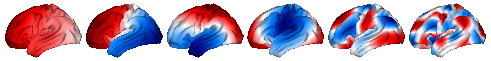

# 大脑特征模式



使用基于特征模式分析来研究大脑几何结构如何约束功能磁共振成像所捕获的功能。

该代码还可以作为一个工具箱，让人们使用自己的数据计算表面和/或体积的几何特征模式（参见 `demo_eigenmode_calculation.sh`）

## 文件描述

1. `data/`: 包含示例数据、分区、经验数据、论文结果、图形源数据、模板特征模式以及模板表面和体积的文件夹；
2. `functions_matlab/`: 包含各种功能分析和可视化的 MATLAB 函数文件夹；
3. `surface_eigenmodes.py`: 用于计算皮层表面几何特征模式的 Python 脚本
4. `volume_eigenmodes.py`: 用于计算三维体积的几何特征模式的 Python 脚本
5. `demo_eigenmode_calculation.sh`: Bash shell 脚本演示如何计算几何特征模式
6. `demo_eigenmode_analysis.m`: 演示如何使用特征模式分析 fMRI 数据的 MATLAB 脚本
7. `demo_eigenmode_visualization.m`: 演示如何可视化表面和体积特征模式的 MATLAB 脚本
8. `demo_connectome_eigenmode_calculation.m`: MATLAB 脚本演示如何计算连接体和EDR连接体特征模式
9. `demo_wave_model_simulation.m`: MATLAB脚本演示如何使用特征模式模拟皮层表面上的波
10. `generate_paper_figures_main_bioRxiv.m`: MATLAB 脚本生成bioRxiv预印本的主要图形
11. `generate_paper_figures_supp_bioRxiv.m`: 生成bioRxiv预印本补充图的 MATLAB 脚本
12. `generate_paper_figures_main_Nature.m`: MATLAB 脚本生成论文的主要图形
13. `generate_paper_figures_supp_Nature.m`: MATLAB 脚本生成论文的补充图
14. `generate_paper_figures_extended_Nature.m`: MATLAB 脚本生成论文的扩展数据图形

## 安装

下载代码仓库，就可以开始了。
阅读每个代码中的注释和文档以获取使用指南。


## 下载数据

由于它们的文件大小超过了 GitHub 允许的限制，您将需要用可以从 [OSF存储库](https://osf.io/xczmp/) 下载的数据填充`data/experitory/`、`data/results/`和`data/template_eignmodes/`目录。总文件大小为 11.3GB。

***非常重要的注意事项：***`generate_paper_figures.m`和`generate_paper_supfigures.m` 的某些部分需要托管在[OSF](https://osf.io/xczmp/) 中的上述数据。因此，您需要将它们保存在适当的文件夹中，以便能够顺利运行这两个脚本**

## 运行
在运行`latex/elegantpaper-cn.tex`脚本生成论文之前运行以下脚本生成所需的图形。
```shell
generate_paper_figures_main_Nature.m
generate_paper_figures_extended_Nature.m
generate_paper_figures_supp_Nature.m
```

## 原始数据

原始经验数据来自[人类连接体项目](https://db.humanconnectome.org/) 。有关访问、许可以及使用条款和条件的详细信息，请参阅链接。


## 依赖项

在运行`demo_eigenmode_calculation.sh`、`surface_eigenmodels.py`或`volume_eigermodes.py`之前，需要做一些重要的工作`


1. 如果使用高性能计算，安装 [FreeSurfer](https://surfer.nmr.mgh.harvard.edu/fswiki/DownloadAndInstall) 并加载模块。
2. 如果使用高性能计算，安装 [Connectome Workbench](https://www.humanconnectome.org/software/get-connectome-workbench) 并加载模块。
3. 如果使用高性能计算，安装 [Gmsh](https://gmsh.info/) 并加载模块。
4. 安装下列 Python 库 (比如通过 pip): [lapy](https://github.com/Deep-MI/LaPy), [nibabel](https://nipy.org/nibabel/) 和 [brainspace](https://brainspace.readthedocs.io/en/latest/pages/install.html)
5. 请确保还拥有以下通用 Python 库: numpy, scipy, os, argparse, subprocess

一些基于 MATLAB 的脚本依赖于其他人开发的包。这些包的副本已存储在`functions_matlab/`文件夹中，以确保版本兼容性。然而，了解更多细节请访问下面他们各自的链接。

1. [gifti](https://github.com/gllmflndn/gifti)
2. [cifti](https://github.com/Washington-University/cifti-matlab)
3. [cbrewer](https://au.mathworks.com/matlabcentral/fileexchange/58350-cbrewer2?s_tid=srchtitle) (注意：该链接适用于新版本cbrewer2，但该代码库使用旧版本。) 
4. Stuart Oldham's [repository](https://github.com/StuartJO/plotSurfaceROIBoundary) 在曲面上绘制ROI边界
5. Frantisek Vasa's [repository](https://github.com/frantisekvasa/rotate_parcellation) 用于创建分割地图的旋转


## 兼容性

这些代码已经在3.7到3.8版本的Python和R2019b到R2020b和R2022b版本的MATLAB上进行了测试。


## 猜想
用重建的方法来预测大脑激活的精度。

几何形状（主要因素）和连接（次要因素）共同决定了大脑的功能。


## 引用

论文 "[Geometric constraints on human brain function](https://www.nature.com/articles/s41586-023-06098-1)" 的[代码和数据](https://github.com/NSBLab/BrainEigenmodes) 。

[PREPRINT] J.C. Pang, K.M. Aquino, M. Oldehinkel, P.A. Robinson, B.D. Fulcher, M. Breakspear, A. Fornito, Geometric constraints on human brain function, bioRxiv (2022) (DOI: [10.1101/2022.10.04.510897](https://www.biorxiv.org/content/10.1101/2022.10.04.510897v2))

[ARTICLE] J.C. Pang, K.M. Aquino, M. Oldehinkel, P.A. Robinson, B.D. Fulcher, M. Breakspear, A. Fornito, Geometric constraints on human brain function, Nature (2023) (VOLUME NUMBER TO BE UPDATED) (DOI: [10.1038/s41586-023-06098-1](https://www.nature.com/articles/s41586-023-06098-1))


## 进一步的详细信息

如果需要任何进一步的细节请联系james.pang1@monash.edu。
